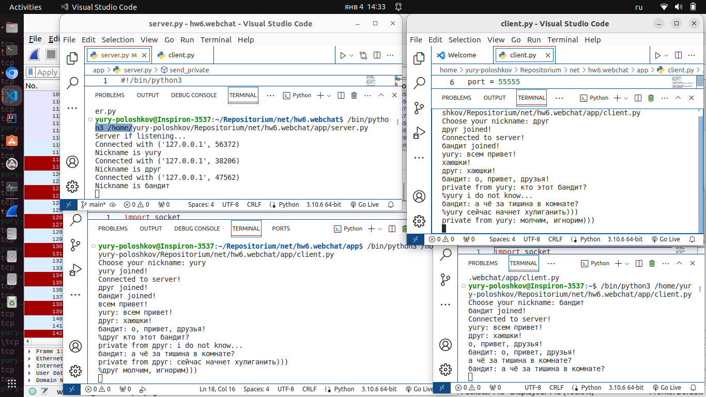
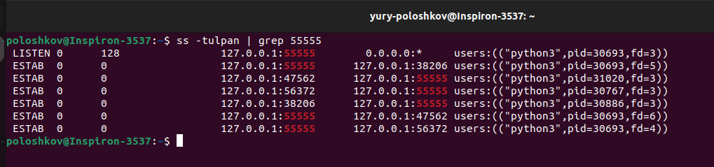
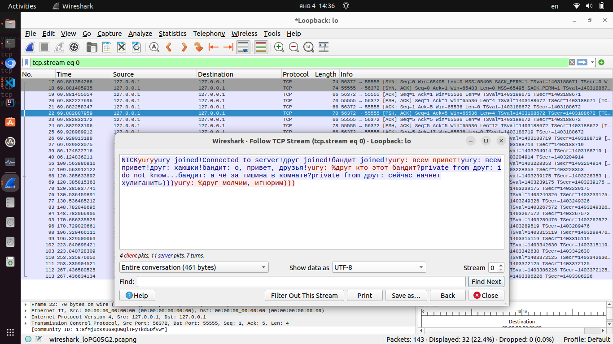

# Компьютерные сети (семинары)

## Домашняя работа к Уроку 6. Основы компьютерных сетей. Транспортный уровень. UDP и TCP

### 1. Напишите свою программу сервер и запустите её (если опыта в python нет, запустите готовый код и разберитесь, как он работает — файл с кодом готового клиента, файл с кодом готового сервера)

Сервер и клиенты запущены на локальном интерфейсе 127.0.0.1: 55555, использован код, предоставленный на семинаре с доработкой:

### '** попробуйте улучшить код, опишите что сделали, какие фичи добавили

- изменена кодировка на _utf-8_ для возможности использовать русский язык;

- добавлена возможность отправлять приватные сообщения: см. # Sending Private Message to <%nickname> Client def send_private(message) в модуле server.py.

### 2. Запустите несколько клиентов, сымитируйте чат

### 3. Отправьте мне код написанного сервера (можете через github, если удобно или прямо здесь в txt формате) и скриншоты работающего чата

Запущены сервер и 3 клиента, сыимирован короткий диалог, в т.ч. с отправкой приватных сообщений.

Код запущенного сервера и клиентов расположен в папке app.

### 4. Отследите сокеты с помощью команды netstat (тоже пришлите скриншот именно сокетов вашего чата)

### 5. Перехватите трафик своего чата в Wireshark и cшейте сессию. Пришлите скриншот сшитой сессии с диалогом

